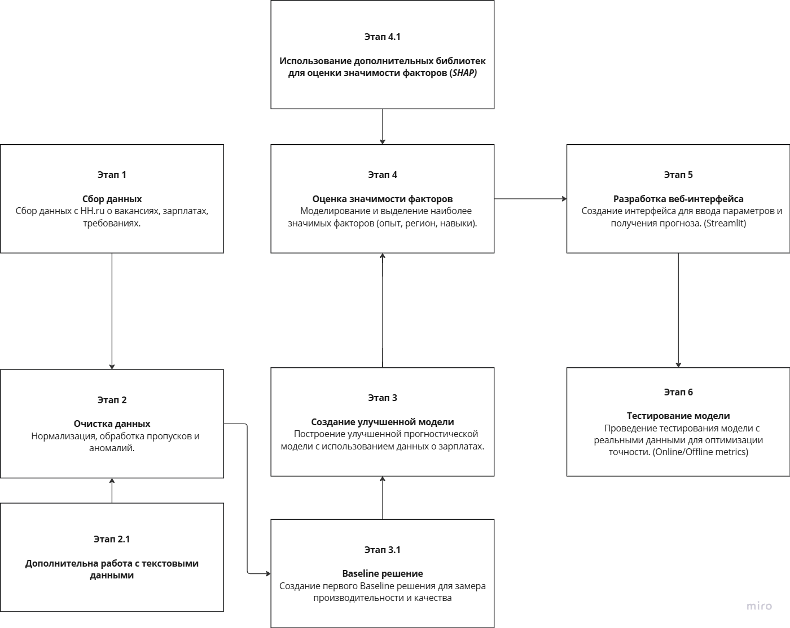

# ML System Design Doc - [RU]

> ## Термины и пояснения
> - Итерация - это все работы, которые совершаются до старта очередного пилота
> - БТ - бизнес-требования
> - EDA - Exploratory Data Analysis - исследовательский анализ данных
> - `Product Owner`,  `Data Scientist` - роли, которые заполняют соответствующие разделы
> - В этом шаблоне роль `Data Scientist` совмещает в себе компетенции классического `Data Scientist` с упором на исследования и `ML Engineer` & `ML Ops` роли с акцентом на продуктивизацию моделей
> - Для вашей организации распределение ролей может быть уточнено в зависимости от операционной модели

### 1. Цели и предпосылки

#### 1.1. Зачем идем в разработку продукта?

- **Бизнес-цель**: Разработать веб-сервис для прогнозирования зарплаты на основе множества факторов (например, опыт, регион, навыки).

  **Retention**: Благодаря функционалу прогнозирования зарплаты пользователи будут возвращаться к сервису для уточнения данных и получения рекомендаций, что способствует увеличению retention. Соискатели могут регулярно проверять, как изменения в их опыте или навыках могут повлиять на зарплатные ожидания, а работодатели — на актуальность своих предложений.

  **Conversion**: Увеличение точности зарплатных прогнозов позволяет точнее настроить ожидания соискателей и работодателей, что приводит к большему числу успешных трудовых сделок. Это может повысить конверсии и улучшить взаимодействие между платформой и ее пользователями.

- **Почему это улучшит текущую ситуацию?**: Важно предоставить пользователям инструмент для более точного прогнозирования зарплат на основе данных с HH.ru и других открытых источников. Это будет полезно как для соискателей, так и для работодателей.

- **Что считаем успехом итерации?**: Успешная итерация будет означать создание работающего прототипа веб-сервиса с прогнозами зарплат, доступных для пользователей, а также демонстрация точности модели с целевой метрикой MAPE в пределах 10-15% от реальной зарплаты (в зависимости от вакансии и доступных данных) с использованием реальных данных.

#### 1.2. Бизнес-требования и ограничения

#### Бизнес-требования:
- **Прогнозирование зарплаты** на основе параметров, таких как опыт, регион, навыки, образование и тип занятости.
- **Интерактивный веб-сервис**, где пользователи могут вводить свои параметры и получать прогнозы по зарплатам.
- **Механизм оценки влияния факторов**: предоставление пользователю информации о том, как каждый фактор (опыт, регион, навыки) влияет на итоговый прогноз и их относительная значимость.
- **Использование данных HH.ru** и других открытых данных для повышения точности прогнозов.

#### Бизнес-ограничения:

- **Точность прогнозов**: Обычно для задач прогнозирования, таких как зарплата, показатель MAPE в пределах 10-20% может считаться достаточным для большинства бизнес-приложений.

- **Время обучения модели**: С учетом всех этапов разработки (сбор данных, обучение модели, настройка, разработка веб-сервиса, пилотное тестирование), разумный срок для завершения итерации разработки модели и запуска в эксплуатацию — это от 6 до 8 недель. В зависимости от сложности задачи и ресурсов, этот срок может варьироваться.

- **Конфиденциальность данных**: Все данные будут собраны из открытых источников и обработаны в соответствии с требованиями GDPR. Личные данные будут анонимизированы или обезличены. Применяются меры безопасности, включая шифрование и регулярные аудиты для защиты данных. Пользователи будут информированы о целях использования данных и смогут дать согласие на их обработку.

#### 1.3. Что входит в скоуп проекта/итерации, что не входит

#### Входит в скоуп проекта:
- Сбор и очистка данных с **HH.ru** и других источников.
- Разработка прогностической модели для предсказания зарплат.
- Разработка веб-интерфейса для пользователей, позволяющего выбирать параметры и получать прогнозы.
- Реализация механизма для отображения влияния факторов на прогноз.

#### Не входит в скоуп проекта:
- Персонализированные данные для конкретных пользователей.
- Детализированные отчеты для конкретных компаний или кандидатов.
- Прогнозирование карьерного роста или других факторов, не связанных с зарплатой.

#### Результат с точки зрения качества:
- Модель с низкой ошибкой прогнозирования в пределах 10-15% MAPE. Это обеспечит достаточную точность для практического использования, позволяя пользователям получать достоверные прогнозы зарплаты. Модель будет оцениваться на реальных данных, и точность прогнозов будет проверяться в различных сценариях для подтверждения её надежности.

- Удобный интерфейс для пользователей, подтвержденный через тестирование UX/UI и обратную связь от целевых пользователей. Удобство будет измеряться через метрики, такие как время на выполнение задачи, уровень удовлетворенности пользователей и коэффициент удержания.

- Демонстрация значимости факторов (опыт, регион, навыки) для прогнозируемых зарплат.

#### 1.4. Предпосылки решения

- **Используемые данные**: данные с **HH.ru** (зарплаты, вакансии, требования) и другие открытые источники (экономические данные).
- **Модели машинного обучения**: использование моделей, таких как линейная регрессия / обобщенные регрессионные модели / деревья решений / градиентный бустинг для построения наилучшей прогностической модели.
- **Ограничения**: модель будет зависеть от доступности и качества данных на момент обучения.

### 2. Методология `Data Scientist`

#### 2.1. Постановка задачи

- **Тип задачи (Data Science)**: Задача регрессии (Supervised Learning) - модель будет обучаться на исторических данных для прогнозирования зарплаты пользователя, основываясь на таких факторах, как регион, опыт работы, квалификация и другие. Цель — создать модель с ошибкой предсказания в пределах 10-15% MAPE, что будет обеспечивать достаточную точность для практического использования.

- **Цель Data Science**: Разработать регрессионную модель, которая обучается на данных о зарплатах, учитывая параметры, такие как опыт, навыки и регион. Ожидаемое качество модели — минимизация ошибки предсказания (в пределах 10-15% MAPE) и повышение точности прогнозов для пользователей. Модель будет оптимизирована для достижения наилучших результатов через корректировку гиперпараметров и выбор наиболее релевантных признаков.

- **Цель Backend**: создание сервиса с поддержкой базы данных, который будет принимать запросы от пользователей, обрабатывать введённые данные (например, через API), передавать их в модель для получения прогноза и возвращать результат. Также необходимо реализовать систему хранения данных (например, о пользователях, их запросах и предсказаниях), а также интерфейсы для взаимодействия с моделью и фронтендом.

- **Цель Frontend**: реализовать веб-интерфейс, который будет позволять пользователям вводить свои данные (регион, опыт работы, навыки и другие параметры) и получать прогнозируемую зарплату. Интерфейс должен быть интуитивно понятным и удобным для пользователя, с возможностью отображения полученного прогноза и рекомендаций по улучшению зарплаты (если такие будут предусмотрены моделью).

- **Цель UX/UI**: создание удобного и эстетически приятного пользовательского интерфейса, который будет учитывать потребности целевой аудитории. Важно обеспечить лёгкость в использовании, хорошую визуализацию данных и быструю реакцию интерфейса на действия пользователя.

#### 2.2. Блок-схема решения

#### 2.3. Этапы решения задачи `Data Scientist`

#### Этап 1. Подготовка данных

На первом этапе работы с данными о вакансиях и зарплатах выполняется сбор, очистка и подготовка информации для дальнейшего анализа и обучения модели. Описание и анализ данных на этом этапе имеют решающее значение для успешности всего проекта.

#### Описание данных/сущностей

Данные, которые используются в модели прогнозирования зарплат, включают информацию о вакансиях, таких как:

- **name** — название вакансии;
- **description** — описание вакансии;
- **employer_name** — название работодателя;
- **salary** — зарплата;
- **schedule** — график работы;
- **key_skills** — ключевые навыки;
- **experience** — требуемый опыт работы;
- **employment** — тип занятости (например, полный рабочий день, неполный);
- **region_name** — регион, в котором предлагается вакансия.

Данные поступают с платформы HH.ru, которая предоставляет подробную информацию о вакансиях на основе реальных предложений на рынке труда. Они включают разнообразные категории информации, необходимые для точного прогнозирования заработной платы, а также анализа рынка труда в разных регионах и для различных типов вакансий.

#### Качество данных

Данные не содержат пропусков, что является положительным аспектом для их дальнейшего использования в модели. Каждая строка содержит все необходимые поля, и на этом этапе не было обнаружено явных проблем с объемом или разметкой данных.

#### Выявленные проблемы на этапе EDA (Exploratory Data Analysis)

- **Неоднородность данных в некоторых колонках**: Например, в колонке *salary* могут быть представлены данные как в виде точных цифр (например, 100,000), так и в виде диапазонов (например, 80,000–120,000). Это требовало предобработки и унификации данных.
- **Кодирование категориальных признако**: Большая часть признаков в данных (например, график работы, требуемый опыт) представлены в виде категорий  из нескольких значений, эти данные потребуют категоризации перед подачей в модель.
- **Текстовые признакие**: Для того, чтобы получить наилучшее качество модели, нужно воспользоваться всей информацией о вакансии и преобразовать текстовые признаки (название вакансии, описание вакансии, название работодателя) в численный формат для модели.

#### Риски и проблемы

- **Недостаточность данных в некоторых сегментах**: В некоторых категориях вакансий может быть недостаточно данных, чтобы модель могла точно прогнозировать зарплату. Это может быть связано с неравномерным распределением вакансий по регионам или с неадекватной представленностью определенных профессий.
  - **Решение**: Использование методов синтетической генерации данных или уменьшение данных больших сегментов данных, однако перед этим нужно получить общее качество модели на этих регионах, и только потом реализовывать эту методику.

#### Процесс генерации данных

Данные поступают с платформы HH.ru в виде API-запросов или выгрузок в формате CSV/JSON. Эти данные регулярно обновляются, что позволяет получать актуальную информацию о вакансиях. Процесс выгрузки данных — автоматизированный парсинг сайта (однако, с декарбя 2024 года начались некоторые проблемы с парсингом, поэтому он не может быть регулярным).

#### Необходимый результат этапа

1. **Очистка и предобработка данных** — Все данные должны быть унифицированы по формату (например, зарплата в одном формате, опыт и график работы также стандартизированы).
2. **Анализ на наличие аномалий** — Важно провести выявление выбросов или других аномалий в данных (например, зарплаты, которые выходят за пределы реального диапазона).
3. **Отчётность и документация** — Протоколирование всех действий на этом этапе для того, чтобы команда могла отслеживать изменения и понимать, как были подготовлены данные.

#### Полезная информация

- **Методы улучшения качества данных**: Для повышения качества данных можно использовать методы очистки, такие как исправление форматов, нормализация диапазонов и категориализация признаков.
- **Конфиденциальная информация**: Данные о вакансиях не являются конфиденциальными, так что можно свободно их использовать.

#### Этап 2. Подготовка прогнозных моделей

На этом этапе создаются и оцениваются прогнозные модели для задачи предсказания зарплаты на основе подготовленных данных. Включает выбор метрик, подходов к валидации, создание бейзлайновых моделей и дальнейшую оптимизацию.

#### Описание ML-метрик и функций потерь

#### Выбранная метрика: **MAPE (Mean Absolute Percentage Error)**
- **Обоснование выбора**: MAPE — это метрика, которая измеряет точность прогноза в процентах, что делает её легко интерпретируемой для бизнеса. Она полезна в задаче прогнозирования зарплаты, так как позволяет оценить, насколько предсказанные значения отличаются от реальных, в процентном выражении. Чем ниже значение MAPE, тем точнее модель. Однако, следует учитывать, что MAPE может быть чувствительной к большим значениям в выборке, и её применение может быть затруднено, если фактические значения равны нулю.

#### Функция потерь:
- Для обучения моделей используется **среднеквадратичная ошибка (MSE)** или **средняя абсолютная ошибка (MAE)** в зависимости от модели. MAE будет использоваться для оценки ошибок в прогнозах, так как она менее чувствительна к выбросам, в отличие от MSE.

#### Описание схемы ML-валидации

Для оценки моделей используется метод **кросс-валидации на 3 фолдах**. Это стандартный способ проверки устойчивости модели и предотвращения переобучения, который подходит для задачи с ограниченными данными. Кросс-валидация позволяет учесть различные подмножества данных, обеспечивая более надежную оценку качества модели.

#### Специфика состава данных:
- Данные представляют собой вакансии с разнообразными признаками, такими как зарплата, опыт работы, регион, график работы и ключевые навыки. Это требует внимательной предобработки и настройки моделей, так как данные содержат как числовые, категориальные, так и текстовые признаки.

#### Бизнес-задача:
- Задача заключается в прогнозировании зарплаты, что является важным для бизнес-анализа рынка труда. Модели должны быть точными (в пределах 15-20% MAPE), чтобы обеспечивать прогнозы с минимальной ошибкой, что помогает HR-специалистам, аналитикам и работодателям в принятии решений о зарплатных предложениях.

#### Функциональные и нефункциональные требования:
- **Функциональные**: Модель должна точно (в пределах 15-20% MAPE) прогнозировать зарплату на основе набора признаков.
- **Нефункциональные**: Модель должна работать быстро (5-10 секунды на весь запрос), как на небольших выборках данных, так и на более крупных, а также быть достаточно простыми для интерпретации и адаптации в реальных условиях бизнеса.

#### Описание структуры бейзлайна

#### Бейзлайн: **Линейная регрессия**
- Линейная регрессия является простым и интерпретируемым методом, который можно использовать в качестве начального (базового) подхода. Она подходит для данных с линейными зависимостями между переменными. Линейная регрессия может быть хорошим стартом для задачи прогнозирования зарплаты, чтобы установить минимальные стандарты точности.

#### Модель 2: **Random Forest**
- Random Forest позволяет более гибко работать с нелинейными зависимостями, и может лучше справляться с различными типами признаков (категориальными, числовыми).

#### Модель 3: **Градиентный бустинг**
- Градиентный бустинг (например, CatBoost или LightGBM) является более мощной моделью для задач с более сложными зависимостями и взаимодействиями между признаками. Он используется для повышения точности модели, учитывая слабые стороны предыдущих моделей и исправляя их ошибки.

#### Процесс моделирования для бейзлайна:
1. **Предобработка данных**: Кодирование категориальных признаков, нормализация или стандартизация числовых признаков (при необходимости), работа с текстовыми признаками.
2. **Обучение и оценка модели**: Используем кросс-валидацию на 3 фолдах для каждой модели, вычисляем MAPE как основную метрику точности прогноза.
3. **Работа с ошибками модели**: Строим графики распределения ошибок в разных сегментах и анализируем то, где модель работает хорошо, а где наоборот работает плохо (есть смещение прогноза или большая дисперсия)

#### Стратегии дальнейшего развития решения

1. **Выбор моделей**:
   - После первичного тестирования бейзлайнов, можно будет оценить другие версии линейной регрессии модели, такие как **Lasso** и **Ridge регрессии** для улучшения результатов линейной модели, или **CatBoost**, если потребуется высокая производительность при работе с категориальными признаками.

2. **Предобработка данных**:
   - Улучшение кодирования категориальных признаков (например, использование **one-hot encoding** или **target encoding** для категорий, которые имеют значительное количество уровней).
   - Применение **feature engineering** для создания новых признаков, которые могут улучшить точность прогноза (например, использование информации о релевантности навыков, комбинации опыта работы и графика работы).

3. **Оптимизация гиперпараметров**:
   - Можно использовать **GridSearchCV**, **RandomizedSearchCV**, **Optuna** для поиска оптимальных гиперпараметров, таких как количество деревьев, глубина деревьев и минимальное количество образцов в листе дерева.

#### Анализ и интерпретация работы модели

Каждая модель будет оцениваться по метрике **MAPE**, что позволит объективно сравнивать её производительность. Ожидается, что линейная регрессия будет показывать наименьшую точность, в то время как Random Forest и градиентный бустинг должны продемонстрировать значительные улучшения в точности прогноза, особенно для более сложных зависимостей между признаками.

#### Интерпретация:
- **Линейная регрессия** даст возможность понять, какие признаки имеют наибольшее влияние на прогнозируемую зарплату.
- **Random Forest и градиентный бустинг** позволят более точно моделировать сложные взаимодействия между признаками, но будут менее интерпретируемыми. (можно воспользоваться feature importance)

#### Риски данного этапа и способы их снижения

- **Переобучение**: Модели могут переобучиться на данных из-за слишком сложных моделей (например, Random Forest или градиентный бустинг). Это можно снизить путем использования регуляризации, кросс-валидации и контроля за гиперпараметрами.
- **Недостаток данных**: Если данных для обучения недостаточно, модели могут плохо обобщать. Для снижения этого риска можно использовать методы аугментации данных или привлекать дополнительные источники данных.
- **Проблемы с категориальными/текстовыми признаками**: Неправильная обработка категориальных/текстовых признаков может привести к потере информации. Решение: использование более эффективных методов кодирования и анализа категориальных/текстовых признаков (новые модели для создания эмбеддингов, использование эвристик для улучшенного кодирование категорий).

#### Необходимый результат этапа

1. **Построенные и обученные модели**: Линейная регрессия, Random Forest и градиентный бустинг, с настроенными гиперпараметрами.
2. **Оценка моделей**: Каждая модель должна быть оценена с помощью MAPE, чтобы определить точность предсказаний и выбрать наиболее подходящую модель.
3. **Отчетность и документация**: Протоколирование каждого шага в процессе моделирования, включая настройки гиперпараметров, результаты оценки моделей и планы для дальнейшего улучшения.

#### Полезная информация

- **Итеративный процесс улучшения**: После получения первых результатов необходимо продолжить оптимизацию моделей и проанализировать ошибки для их исправления.
- **Компромисс между точностью и интерпретируемостью**: Важно найти баланс между точностью модели и её возможностью быть объясненной для бизнес-задачи, особенно при использовании сложных моделей, таких как Random Forest и градиентный бустинг.

#### Этап 3: Дополнительная оценка значимости факторов для бизнес-заказчиков

#### Метод:
Для оценки значимости факторов, влияющих на прогнозируемую зарплату, мы используем методы интерпретации моделей, которые позволяют понять, как каждый из признаков влияет на итоговое предсказание. Это важно для обеспечения прозрачности работы модели и объяснения бизнес-решений, основанных на её выводах.

- **SHAP**:
  - SHAP является мощным методом для интерпретации сложных моделей, таких как случайные леса и градиентный бустинг. Он помогает вычислить вклад каждого признака в конкретное предсказание, давая возможность увидеть, какие факторы (например, опыт работы, график работы, регион) оказывают наибольшее влияние на прогнозируемую зарплату для каждой вакансии.
  - SHAP вычисляет средневзвешенные значения влияния признаков, чтобы объяснить, как изменение конкретного признака (например, увеличение опыта на 1 год) изменяет итоговое предсказание зарплаты.

- **LIME**:
  - LIME создаёт локальные интерпретируемые модели, которые аппроксимируют поведение более сложных моделей вблизи конкретного примера. Это означает, что LIME позволяет разобрать модель на более маленькие участки, что помогает понять, как она принимает решения для отдельных наблюдений.
  - С помощью LIME можно проанализировать важность каждого признака в контексте конкретной вакансии и увидеть, какие из признаков наиболее важны для предсказания зарплаты.

#### Результат:
- **Анализ важности признаков**: Мы получим точное представление о том, какие признаки (например, опыт работы, ключевые навыки, график работы, регион) оказывают наибольшее влияние на предсказания зарплаты.
- **Интерпретация модели**: Понимание того, какие переменные играют ключевую роль в прогнозах, помогает не только улучшить модель, но и сделать её более прозрачной и объяснимой для пользователей.
- **Рекомендации для бизнеса**: На основе анализа важности факторов можно предложить рекомендации для улучшения предложений по зарплатам, например, выделить навыки или опыт, которые наиболее критичны для высоких зарплат.

#### Этап 4: Разработка веб-интерфейса

#### Функциональность:
Целью этого этапа является создание простого и удобного интерфейса для пользователей, который позволит им вводить данные о вакансии и получать прогнозируемую зарплату. Веб-интерфейс должен быть интуитивно понятным, быстро обрабатывать запросы и обеспечивать корректную работу модели в реальных условиях.

1. **Основные компоненты интерфейса**:
   - **Форма ввода данных**: Пользователь должен иметь возможность вводить основные параметры вакансии:
     - Тип занятости (например, полный рабочий день, неполный день).
     - Опыт работы (например, 1-3 года, от 3 лет).
     - Ключевые навыки (например, программирование на Python, работа с SQL).
     - Регион (например, Москва, Санкт-Петербург).
     - График работы (например, удаленно, гибкий график).
   - **Кнопка для получения прогноза**: После того как пользователь введет все данные, он нажимает кнопку, и модель генерирует прогнозируемую зарплату для указанной вакансии.
   - **Результат прогноза**: Прогнозируемая зарплата будет отображаться в виде числа с возможной информацией о диапазоне (например, от 80,000 до 100,000 рублей).

2. **Техническая реализация**:
   - Веб-интерфейс будет построен с использованием популярного фреймворка **Streamlit**, которые позволяют быстро развернуть и запустить интерфейс для машинного обучения.
   - **Backend**: Модель будет интегрирована с серверной частью, которая будет принимать данные от пользователя, обрабатывать их и передавать в обученную модель для получения прогноза.

#### Результат:
- **Работающий веб-сервис**: Разработан полноценный веб-интерфейс, который позволяет пользователю вводить данные и получать прогнозируемую зарплату на основе обученной модели.
- **Удобство использования**: Интерфейс должен быть легким в использовании, с понятными полями ввода и быстрым выводом результата, обеспечивая положительный пользовательский опыт.
- **Подготовка к развертыванию**: Веб-сервис готов к тестированию и развертыванию на сервере или в облаке для дальнейшего использования в бизнесе.

## 3. Подготовка пилота

### 3.1. Способ оценки пилота
- Краткое описание дизайна пилота: запуск пилотного проекта с реальными пользователями для оценки точности модели и удовлетворенности пользователей.

### 3.2. Что считаем успешным пилотом
- Успех пилота заключается в достижении точности модели, соответствующей бизнес-целям, и положительных отзывах пользователей.

### 3.3. Подготовка пилота
- Ожидаемая вычислительная сложность будет определяться на этапе тестирования. Планируем провести тесты с ограничениями по вычислительным мощностям.

## 4. Внедрение для production систем

### 4.1. Архитектура решения
- Архитектура включает в себя веб-сервис, модель прогнозирования, базу данных с результатами и API для взаимодействия с системой.

### 4.2. Описание инфраструктуры и масштабируемости
- Мы используем облачные ресурсы для хостинга модели и веб-сервиса, что обеспечит масштабируемость и отказоустойчивость системы.

### 4.3. Требования к работе системы
- SLA для ответа на запросы пользователей: Время отклика на запрос пользователя не должно превышать 5-7 секунд при уровне запросов не более X RPS (например, 50 или 100 запросов в секунду), где X — оптимальный показатель для ожидаемой нагрузки системы. При превышении этого порога, возможна оптимизация, например, с использованием кэширования, масштабирования инфраструктуры или оптимизации работы модели.

### 4.4. Безопасность системы
- В системе предусмотрены меры для защиты данных пользователей и защиты от атак.

### 4.5. Безопасность данных
- Все данные обрабатываются в соответствии с требованиями GDPR и других норм по защите данных.

### 4.6. Издержки
- Ожидаемые издержки будут включать расходы на серверы и хранение данных, которые будут уточнены на этапе пилота.

### 4.7. Риски
- Риски включают возможное недооцененное влияние некоторых факторов на точность модели, что будет проверяться в процессе пилотирования.
